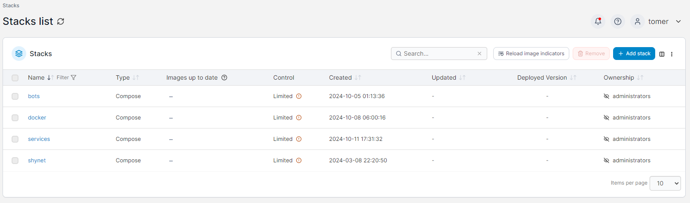

# My self hosted applications list
In this repo I will share all the Self hosted applications I'm using in my Test, Dev and prod environments

Some of my applications are running on the [Oracle free tier](https://medium.com/@tomer.klein/oracle-free-tier-a-robust-and-complimentary-server-solution-lifetime-access-b09a6570092e)


## Common infrastructure
On all of my environments 90% of the applications runs on docker containers.

* Install [docker + docker-compose](https://medium.com/@tomer.klein/step-by-step-tutorial-installing-docker-and-docker-compose-on-ubuntu-a98a1b7aaed0)

* Manage your docker environment using [portainer](https://www.portainer.io/)




```yaml
---
version: "3.7"

services:

  portainer:
    image: portainer/portainer-ce:latest
    ports:
      - "9000:9000"
    container_name: portainer
    security_opt:
      - no-new-privileges:true
    labels:
      - "com.ouroboros.enable=true"
      - "traefik.enable=false"
    networks:
      - docker
    volumes:
      - ./portainer/data:/data #map named volume to directory in container
      - /var/run/docker.sock:/var/run/docker.sock ###Comment this line out in Windows
      - /etc/localtime:/etc/localtime:ro
    restart: always
```

* [*Ouroboros*](https://github.com/pyouroboros/ouroboros) - Automatically update your running Docker containers to the latest available image.

```yaml

  auto-updater:
    image: pyouroboros/ouroboros:latest
    hostname: ouroboros
    container_name: ouroboros
    restart: always
    networks:
      - docker
    environment:
      -  TZ=TZ=${TZ}
    #For a full list of options for ouroboros, see https://github.com/pyouroboros/ouroboros/wiki/Usage
      - CLEANUP=true #delete old images after update
      - DOCKER_SOCKETS="unix://var/run/docker.sock" #comment this line out on windows
      #- DOCKER_SOCKETS="npipe:////./pipe/docker_engine tcp://localhost:2375" #uncomment this line on windows
      # Define how often to check for updates, defaults to a minimum of 300 (30 seconds)
      - INTERVAL=300
      - LOG_LEVEL=info
      #make ouroboros self-updating
      - SELF_UPDATE=true
      #get auto-update config from labels and only labels.  If a container is not labeled to auto update, don't autoupdate
      - LABEL_ENABLE=true
      - LABELS_ONLY=true
      - NOTIFIERS=
       #optional alternative way to check interval (overriding INTERVAL)
      #Specify how often to check for updates using a cron string (see https://devhints.io/cron)
      #this string means every 30 minutes of every hour of every day of every month at every day of the week
      - CRON="*/30 * * * *"
    labels:
      - "traefik.enable=false"
      - "com.ouroboros.enable=true" #Yes, it can watch and update itself
    #Docker images are a base file system with deltas (changes) representing the steps to go from a base to the
    #finished product overlayed on top of it.  As such, changes you make to data in an image is really happening
    #in yet another delta layer on top of the rest.  This layer is considered temporary and really only something
    #you use if you're building your own image from an existing one as a base.  Any data you need to persist
    #should be stored in a Docker volume.  Docker volums can either be named storage locations that can be defined
    #here in the compose file, or bind mounts to directories on the host machine both of which you can use
    #to store data that persists between runs of a container and can be shared between multipe containers.
    #see https://docs.docker.com/compose/compose-file/#volumes for more information
    volumes:
      #allows ouroboros to monitor for changes and to read labels
      - /var/run/docker.sock:/var/run/docker.sock ###Comment this line out in Windows
      - /etc/localtime:/etc/localtime:ro

```


## Home (OnPrem)
At home, I have many services and applications for Media managment, Home automations, IoT and more.

### Common Infrastructure:
* [Safeline](https://github.com/chaitin/SafeLine) WAF and Reverse proxy.
* [Chrony](https://github.com/dockur/chrony) - selfhosted NTP server.
* [postfix-relay](https://medium.com/@tomer.klein/ntp-server-on-docker-keeping-your-devices-in-perfect-sync-2d2447b1d039) - selfhosted mail-relay
* [Mosquitto](https://medium.com/@tomer.klein/docker-compose-and-mosquitto-mqtt-simplifying-broker-deployment-7aaf469c07ee) MQTT Broker.
* [AdGuardHome](https://medium.com/@tomer.klein/protecting-your-digital-world-adguard-home-installation-and-configuration-59db9902b1a0) - DNS, Paental control and Add blocker.
* [PiAlert](https://github.com/jokob-sk/NetAlertX/blob/main/docs/MIGRATION.md) - WIFI / LAN intruder detector.
* *mysql database*
```yaml
  mysql:
    container_name: mysql
    image: mariadb:latest
    ports:
      - "3306:3306"
    environment:
      - MYSQL_PASSWORD=${MYSQL_ROOT_PASSWORD}
      - MYSQL_ROOT_PASSWORD=${MYSQL_ROOT_PASSWORD}
    labels:
      - "com.ouroboros.enable=true"
      - "traefik.enable=false"
    volumes:
      - "./mysql:/var/lib/mysql"
      - /etc/localtime:/etc/localtime:ro
    restart: always
```
* *phpmyadmin*
```yaml
phpmyadmin:
    hostname: phpmyadmin
    container_name: phpmyadmin
    image: phpmyadmin/phpmyadmin:latest
    restart: always
    links:
      - mysql
    ports:
      - 8081:80
    environment:
      - PMA_HOST=${PMA_HOST:?Please copy template.env to .env and provide provide a value for PMA_HOST}
      - MYSQL_ROOT_PASSWORD=${MYSQL_ROOT_PASSWORD}
    labels:
      - "com.ouroboros.enable=true"
    volumes:
      - /etc/localtime:/etc/localtime:ro 

```