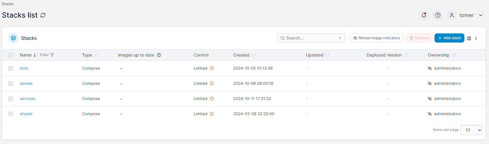

# My Self-Hosted Applications List

In this repo I share all the self-hosted applications I'm using in my test, dev and prod environments.

Some of my applications are running on the [Oracle Free Tier](https://medium.com/@tomer.klein/oracle-free-tier-a-robust-and-complimentary-server-solution-lifetime-access-b09a6570092e).

Each entry links to the project itself, to a post I wrote about setting it up, or to a related article. Where it helps, I've included the Docker Compose snippet I use.

## Table of Contents

- [Common Infrastructure](#common-infrastructure)
- [Home (On-Prem)](#home-on-prem)
  - [Home Infrastructure](#home-infrastructure)
  - [Bots](#bots)
  - [Home Automation](#home-automation)
  - [AI](#ai)
  - [Media](#media)
- [Notes](#notes)

## Common Infrastructure

In all of my environments, 90% of the applications run in Docker containers.

* Install [Docker + Docker Compose](https://medium.com/@tomer.klein/step-by-step-tutorial-installing-docker-and-docker-compose-on-ubuntu-a98a1b7aaed0).

* Manage your Docker environment using [Portainer](https://www.portainer.io/).



```yaml
---
version: "3.7"

services:

  portainer:
    image: portainer/portainer-ce:latest
    ports:
      - "9000:9000"
    container_name: portainer
    security_opt:
      - no-new-privileges:true
    labels:
      - "com.ouroboros.enable=true"
      - "traefik.enable=false"
    networks:
      - docker
    volumes:
      - ./portainer/data:/data # map named volume to directory in container
      - /var/run/docker.sock:/var/run/docker.sock ### Comment this line out on Windows
      - /etc/localtime:/etc/localtime:ro
    restart: always
```

* [Ouroboros](https://github.com/pyouroboros/ouroboros) - Automatically updates your running Docker containers to the latest available image.

```yaml

  auto-updater:
    image: pyouroboros/ouroboros:latest
    hostname: ouroboros
    container_name: ouroboros
    restart: always
    networks:
      - docker
    environment:
      - TZ=${TZ}
      # For a full list of options for Ouroboros, see https://github.com/pyouroboros/ouroboros/wiki/Usage
      - CLEANUP=true # delete old images after update
      - DOCKER_SOCKETS="unix://var/run/docker.sock" # comment this line out on Windows
      #- DOCKER_SOCKETS="npipe:////./pipe/docker_engine tcp://localhost:2375" # uncomment this line on Windows
      # Define how often to check for updates, in seconds (default 300; minimum 30)
      - INTERVAL=300
      - LOG_LEVEL=info
      # make Ouroboros self-updating
      - SELF_UPDATE=true
      # get auto-update config from labels and only labels. If a container is not labeled to auto-update, don't auto-update
      - LABEL_ENABLE=true
      - LABELS_ONLY=true
      - NOTIFIERS=
      # optional alternative way to set the check interval (overrides INTERVAL)
      # Specify how often to check for updates using a cron string (see https://devhints.io/cron)
      # this string means every 30 minutes of every hour of every day of every month on every day of the week
      - CRON="*/30 * * * *"
    labels:
      - "traefik.enable=false"
      - "com.ouroboros.enable=true" # Yes, it can watch and update itself
    # Docker images are a base file system with deltas (changes) representing the steps to go from a base to the
    # finished product overlaid on top of it. As such, changes you make to data in an image are really happening
    # in yet another delta layer on top of the rest. This layer is considered temporary and really only something
    # you use if you're building your own image from an existing one as a base. Any data you need to persist
    # should be stored in a Docker volume. Docker volumes can either be named storage locations that are defined
    # here in the compose file, or bind mounts to directories on the host machine, both of which you can use
    # to store data that persists between runs of a container and can be shared between multiple containers.
    # See https://docs.docker.com/compose/compose-file/#volumes for more information
    volumes:
      # allows Ouroboros to monitor for changes and to read labels
      - /var/run/docker.sock:/var/run/docker.sock ### Comment this line out on Windows
      - /etc/localtime:/etc/localtime:ro

```

## Home (On-Prem)

At home, I have many services and applications for media management, home automation, IoT and more.

### Home Infrastructure

* [SafeLine](https://github.com/chaitin/SafeLine) - WAF and reverse proxy.
* [Chrony](https://github.com/dockur/chrony) - Self-hosted NTP server.
* [postfix-relay](https://medium.com/@tomer.klein/ntp-server-on-docker-keeping-your-devices-in-perfect-sync-2d2447b1d039) - Self-hosted mail relay. <!-- TODO: verify - this link points to the NTP server post, not a postfix-relay post -->
* [Mosquitto](https://medium.com/@tomer.klein/docker-compose-and-mosquitto-mqtt-simplifying-broker-deployment-7aaf469c07ee) - MQTT broker.
* [AdGuard Home](https://medium.com/@tomer.klein/protecting-your-digital-world-adguard-home-installation-and-configuration-59db9902b1a0) - DNS, parental control and ad blocker.
* [PiAlert (now NetAlertX)](https://github.com/netalertx/NetAlertX/blob/main/docs/MIGRATION.md) - Wi-Fi / LAN intruder detector.
* *MySQL database (MariaDB)*

```yaml
  mysql:
    container_name: mysql
    image: mariadb:latest
    ports:
      - "3306:3306"
    environment:
      - MYSQL_PASSWORD=${MYSQL_ROOT_PASSWORD}
      - MYSQL_ROOT_PASSWORD=${MYSQL_ROOT_PASSWORD}
    labels:
      - "com.ouroboros.enable=true"
      - "traefik.enable=false"
    volumes:
      - "./mysql:/var/lib/mysql"
      - /etc/localtime:/etc/localtime:ro
    restart: always
```

* *phpMyAdmin*

```yaml
  phpmyadmin:
    hostname: phpmyadmin
    container_name: phpmyadmin
    image: phpmyadmin/phpmyadmin:latest
    restart: always
    links:
      - mysql
    ports:
      - 8081:80
    environment:
      - PMA_HOST=${PMA_HOST:?Please copy template.env to .env and provide a value for PMA_HOST}
      - MYSQL_ROOT_PASSWORD=${MYSQL_ROOT_PASSWORD}
    labels:
      - "com.ouroboros.enable=true"
    volumes:
      - /etc/localtime:/etc/localtime:ro

```

### Bots

* [Red Alert](https://github.com/t0mer/Redalert) - Pikud Haoref (Home Front Command) alerts.
* [Wazy](https://github.com/t0mer/Wazy) - Checks travel times using Waze.
* [WAssist](https://github.com/t0mer/WAssist) - WhatsApp-based personal assistant.
* [Botami](https://github.com/t0mer/Botami4) - Control a Tami4 Edge using a Telegram bot.
* [Weathy](https://github.com/t0mer/weathy) - Daily forecast Telegram bot.
* [DeOldify](https://github.com/t0mer/DeOldify) - Brings the color back to old pictures.

### Home Automation

* [Home Assistant](https://www.home-assistant.io/) - Open source home automation that puts local control and privacy first.
* [Broadlink Manager](https://github.com/t0mer/broadlinkmanager-docker) - Control your Broadlink devices.
* [TasmoAdmin](https://tasmota.github.io/docs/TasmoAdmin/) - Administrative website for devices flashed with Tasmota.
* [Xiaomi Token Extractor](https://github.com/t0mer/Xiaomi-Token-Extractor) - Extract your Xiaomi devices' tokens.
* [adb-api](https://github.com/t0mer/adb-api) - Control Android-based streamers like Xiaomi and more.
* [tasmota-thingsboard-daemon](https://github.com/t0mer/tasmota-thingsboard-daemon/) - Bridge between Tasmota devices and a ThingsBoard server.

### AI

* [DeepStack](https://github.com/johnolafenwa/DeepStack/) - The world's leading cross-platform AI engine for edge devices.
* [DeepStack Trainer](https://github.com/t0mer/deepstack-trainer).
* [DeepStack UI](https://medium.com/deepquestai/deepstack-ui-object-detection-with-zero-code-e4e6f1bf8ba4) - Interactive web application built by Robin Cole. It allows anyone to run any image through DeepStack's object detection API.
* [CodeProject.AI](https://www.codeproject.com/Articles/5322557/CodeProject-AI-Server-AI-the-easy-way) - Self-hosted, fast, free and open source artificial intelligence server.

### Media

* [Plex](https://www.plex.tv/) - Free movies & TV with the best free streaming services.
* [Tautulli](https://tautulli.com/) - Monitor your Plex Media Server.
* [Conreq](https://github.com/Archmonger/Conreq) - A content requesting platform.

## Notes

This is a personal list that reflects what I actually run, and it changes over time. The Compose snippets are fragments of my own stacks. Service fragments go under a `services:` key. The snippets attach to a network named `docker` that they don't define, so create it first (for example with `docker network create docker`) or declare it under a top-level `networks:` key, and set the referenced variables (`TZ`, `MYSQL_ROOT_PASSWORD`, `PMA_HOST`) in your `.env` file.
